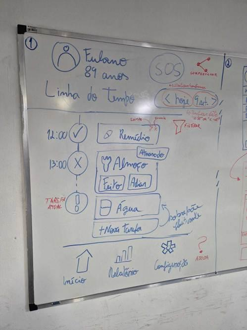
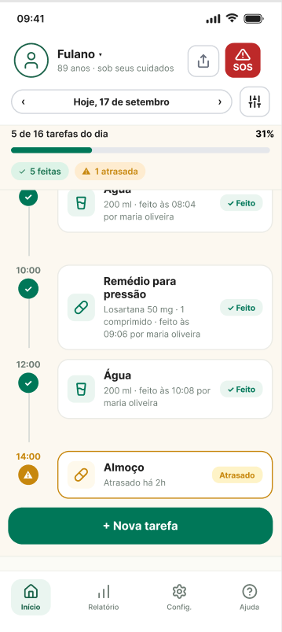
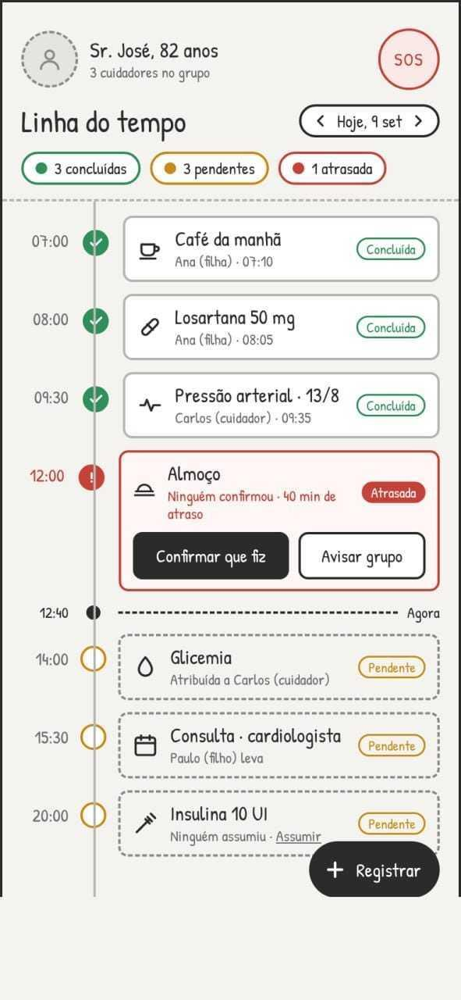

# Bem Cuidar · Protótipo de alta fidelidade

Protótipo navegável do **Bem Cuidar**, aplicativo de monitoramento e gestão compartilhada de cuidados com idosos, desenvolvido na disciplina de Interação Humano-Computador do curso de Sistemas de Informação do CEFET/RJ, campus Nova Friburgo (2026).

**Acesse:** https://andersouza.github.io/bem-cuidar/

No computador, o app aparece dentro de um celular, com um painel de demonstração ao lado para simular horários e situações. No celular, ele ocupa a tela inteira.

<!-- SCREENSHOTS -->

## O que o protótipo mostra

As quatro funcionalidades principais da documentação (seção 2.1) estão implementadas e funcionando:

- **Linha do tempo.** Tela inicial com as tarefas do dia em ordem cronológica, horário, responsável e estado (feito, pendente ou atrasado), marcador "Agora", resumo do dia e navegação entre dias.
- **Notificações e alarmes.** Tarefas de horário rígido disparam um alarme insistente. Se ninguém confirmar no prazo configurado, o aviso é repassado aos demais cuidadores. Tarefas comuns geram só um lembrete discreto.
- **Sistema de emergência.** Botão SOS em todas as telas, confirmação em dois toques, tela de emergência com alergias, condições de saúde, remédios com a última dose, contatos, médico e atalho para o SAMU (192).
- **Participação dos cuidadores.** Relatório semanal ou mensal com quantas tarefas cada pessoa fez, pontualidade nos horários rígidos e constância, apresentado como transparência e não como competição.

Também atende requisitos que surgiram nas entrevistas e nas histórias de usuário: registro de ocorrências e sintomas, assumir tarefas sem responsável, adiar, editar e excluir tarefas, documentos e exames do idoso, resumo para a consulta médica, letras grandes, alto contraste, tutorial de primeira abertura e funcionamento sem internet.

## Roteiro de apresentação

Use o painel de demonstração, à esquerda do celular no computador, ou em **Config. > Abrir painel de demonstração** no celular.

1. **Cenário 1, troca de turno sem ruído.** Você é a Ana. São 12:40 e o almoço das 12:00 está atrasado. Toque em **Avisar grupo**: alguns segundos depois o Carlos confirma com uma observação.
2. **Alarme de remédio.** Em **Simular > Alarme de remédio**, ou avançando o relógio até 13:00, toca o alarme da Metformina. Confirme ou adie. Sem confirmação, o grupo é avisado.
3. **Cenário 2, emergência na madrugada.** Você é o Carlos, às 03:00. Toque em **SOS**, confirme e veja a tela de emergência. Ligue para o SAMU e depois registre a ocorrência.
4. **Relatório.** Veja a participação de cada cuidador na semana e no mês e o resumo para a consulta médica.
5. **Acessibilidade.** Em **Config.**, aumente o tamanho do texto e ative o alto contraste.

## Alinhamento com os protótipos anteriores

| Baixa fidelidade (quadro) | Média fidelidade (Figma) | Apoio de IA |
|---|---|---|
|  |  |  |

A alta fidelidade mantém a estrutura do Figma: cabeçalho com o idoso, compartilhar e SOS; navegação de data com filtro; progresso do dia; linha do tempo com nós de estado; botão "Nova tarefa"; e as abas Início, Relatório, Config. e Ajuda. Do esboço vieram as ações Feito e Adiar, editar e excluir. Da versão com IA vieram "Confirmar que fiz", "Avisar grupo", "Assumir" e o marcador "Agora".

## Decisões de design

- **Legibilidade.** Fonte Atkinson Hyperlegible, criada para leitura por pessoas com baixa visão, e tamanho de texto ajustável em três níveis.
- **Estado nunca só pela cor.** Todo estado tem ícone e texto (Feito, Atrasado, Pendente), o que também ajuda no alto contraste.
- **Alvos de toque grandes.** Botões com pelo menos 44 px e ações principais com largura total.
- **Prevenção de erros.** SOS pede um segundo toque. Excluir e desfazer pedem confirmação. Confirmações rápidas mostram "Desfazer".
- **Retorno imediato.** Toda ação responde com um aviso curto, e o grupo é notificado sem a pessoa precisar escrever.
- **Linguagem simples.** Textos curtos e verbos diretos, pensando em cuidadores com pouca familiaridade com aplicativos.

## Como rodar localmente

Não há dependências nem etapa de build. Na pasta do projeto:

```bash
python3 -m http.server 8000
```

Depois abra http://localhost:8000. Os dados são fictícios e ficam salvos só no navegador. Para recomeçar, use **Restaurar dados de demonstração**.

A estrutura do código está descrita em [docs/ARQUITETURA.md](docs/ARQUITETURA.md).

## Equipe

Anderson Souza, Paulo Victor Silva Affonso, Saulo Klein e Victória Pimentel.
